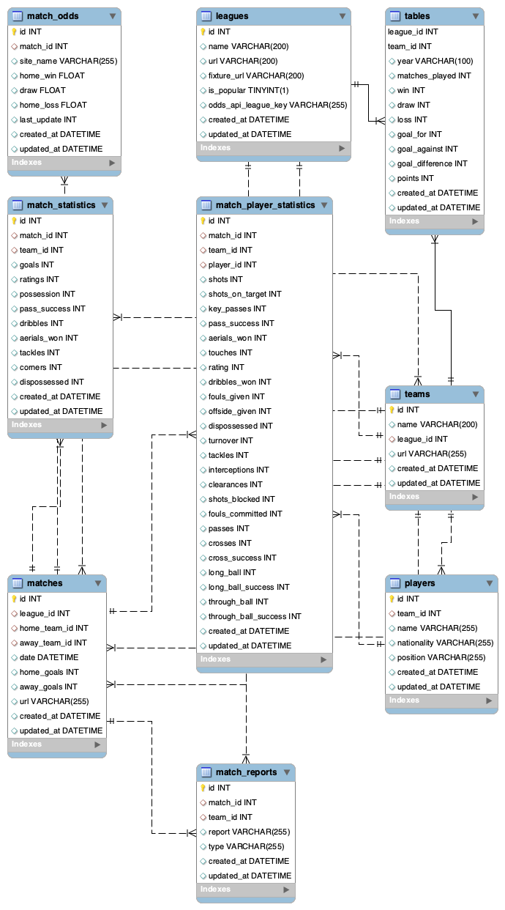

# Data Mining - ITC

A python script to scrape data from the [WhoScored](https://whoscored.com).
It scrapes data from all of the top leagues such as the league table, next matches,
match statistics and players statistics for each match. 

## Installation

Install requirements

```bash
pip install -r requirements.txt
```

You need to download [chromedriver](https://chromedriver.chromium.org/downloads) of the same version of the 
Google Chrome browser installed in your machine. 

## Usage

The usage is the following.

    usage: app.py [-h] --driver DRIVER [--create_db] [--seed] [--populate]
              [--league {Premier League,Serie A,LaLiga,Bundesliga,Ligue 1,Liga NOS,Eredivisie,Premier League,Brasileirão,Major League Soccer,Super Lig,Championship,Premiership,League One,League Two,Superliga,Jupiler Pro League,Super league,Bundesliga II,Champions League,Europa League,UEFA Nations League A}]
              [--match] [--stat] [--all] [--daterange DATERANGE]

Some example executions:

    python app.py --driver [driver_path] --all
    python app.py --driver [driver_path] --league "Serie A" --match
    python app.py --driver [driver_path] --league "Serie A" --daterange 01/11/2020
    python app.py --driver [driver_path] --match
    python app.py --driver [driver_path] --seed --populate
    
-   `--driver`  path to the chrome driver for scraping pages.
-   `--create_db`  creates the database.
-   `--seed`  insert all of leagues to the table.
-   `--populate`  only if seed is passed. It populates tables with scraped data.
-   `--league`  specifies a certain league.
-   `--match` 	specifies to scrape recent matches. If the league argument is added, it will get all matches within a league.
-   `--stat` 	specifies to scrape statistics of matches. If the league argument is added, it will get all matches within a league.
-   `--daterange`  specifies a start date for scraping. The end date is always the current date. Format (YYYY/MM/DD)


## Database



Description of the tables and their columns:
- **leagues**: League from a championship
    - `id`: PRIMARY KEY, INT auto incremental
    - `name`: VARCHAR, Name of the league
    - `url`: VARCHAR, Url of the website that contains information of the league
    - `is_popular`: BOOLEAN, Flag that indicates that a league is popular or not
- **teams**: A team from that is playing in one of the leagues
    - `id`: INT, auto incremental
    - `name`: VARCHAR, Name of the team
    - `league_id`: FOREIGN KEY, INT, id of the league
    - `url`: VARCHAR, Url of the website that contains information of the team
- **tables**: League table with information of current situation in the league (points, win, draw, losses, ...)
    - `league_id`: FOREIGN KEY, INT, id of the league
    - `team_id`: FOREIGN KEY, INT, id of the team
    - `year`: VARCHAR, Year of the league
    - Primary key: [`league_id, team_id, year`]
    - `matches_played`: INT, Number of matches played in this league
    - `win`: INT, Number of wins in this league
    - `draw`: INT, Number of draws in this league
    - `loss`: INT, Number of losses in this league
    - `goal_for`: INT, Number of goals scored in this league
    - `goal_against`: INT, Number of goals against in this league
    - `goal_difference`: INT, Number of difference between goals_for and goals_against in this league
    - `points`: INT, Number of points in this league
- **player**: Player of a team
    - `id`: PRIMARY KEY, INT auto incremental
    - `team_id`: FOREIGN KEY, INT, id of the team
    - `name`: VARCHAR, Name of the player
    - `nationality`: VARCHAR, Nationality of the player
    - `position`: VARCHAR, Position of the player
- **matches**: Matches of a league
    - `id`: PRIMARY KEY, INT auto incremental
    - `league_id`: FOREIGN KEY, INT, id of the league
    - `home_team_id`: FOREIGN KEY, INT, id of the team that plays at home
    - `away_team_id`: FOREIGN KEY, INT, id of the team that plays away 
    - `date`: DATETIME, Date of the match
    - `home_goals`: INT, Number of goals scored by the home team
    - `away_goals`: INT, Number of goals scored by the away team
    - `url`: VARCHAR, Url of the page with more information of the match
- **match_report**: Match reports of a match
    - `id`: PRIMARY KEY, INT auto incremental
    - `match_id`: FOREIGN KEY, INT, id of the match
    - `team_id`: FOREIGN KEY, INT, id of the team 
    - `report`: VARCHAR, Report of the match
    - `type`: VARCHAR, type of the report of the match
- **match_statistics**: Match statistics of a match
    - `id`: PRIMARY KEY, INT auto incremental
    - `match_id`: FOREIGN KEY, INT, id of the match
    - `team_id`: FOREIGN KEY, INT, id of the team 
    - `goals`: INT, Number of goals in the match
    - `ratings`: DOUBLE, Rating of the team in the match
    - `shots`: INT, Number of shots in the match
    - `possession`: DOUBLE, % Possession of the ball in the match
    - `pass_success`: DOUBLE, % Passes success in the match
    - `dribbles`: INT, Number of dribbles in the match
    - `aerials_won`: INT, Number of aerials won in the match
    - `tackles`: INT, Number of tackles in the match
    - `corners`: INT, Number of corners in the match
    - `dispossessed`: INT , Number of dispossession in the match
- **match_statistics**: Match statistics of a player in a match
    - `id`: PRIMARY KEY, INT auto incremental
    - `match_id`: FOREIGN KEY, INT, id of the match
    - `team_id`: FOREIGN KEY, INT, id of the team 
    - `player_id`: FOREIGN KEY, INT, id of the player 
    - `shots`: INT, Number of shots of the player in the match
    - `shots_on_target`: INT, Number of shots on target of the player in the match
    - `key_passes`: INT, Number of key passes of the player in the match
    - `pass_success`: DOUBLE, % pass success of the player in the match
    - `aerials_won`: INT, Number of aerials won of the player in the match
    - `touches`: INT, Number of touches of the player in the match
    - `rating`: DOUBLE, Rating of the player in the match
    - `dribbles_won`: INT, Number of dribbles of the player in the match
    - `fouls_given`: INT, Number of fouls given of the player in the match
    - `offside_given`: INT, Number of offsides given of the player in the match
    - `dispossessed`: INT, Number of dispossession of the player in the match
    - `turnover`: INT, Number of turnovers of the player in the match
    - `tackles`: INT, Number of tackles of the player in the match
    - `interceptions`: INT, Number of interceptions of the player in the match
    - `clearances`: INT, Number of clearances of the player in the match
    - `shots_blocked`: INT, Number of shots blocked of the player in the match
    - `fouls_committed`: INT, Number of fouls committed of the player in the match
    - `passes`: INT, Number of passes of the player in the match
    - `crosses`: INT, Number of crosses of the player in the match
    - `cross_success`: INT, Number of success crosses of the player in the match
    - `long_ball`: INT, Number of long balls of the player in the match
    - `long_ball_success`: INT, Number of success long balls of the player in the match
    - `through_ball`: INT, Number of through balls of the player in the match
    - `through_ball_success`: INT, Number of success through balls of the player in the match
 
    
## Contributing
Please refer to contribution guidelines for submitting patches and additions. In general, we follow the "fork-and-pull" Git workflow.

1. Fork the repo on GitHub
2. Clone the project to your own machine
3. Commit changes to your own branch
4. Push your work back up to your fork
5. Submit a Pull request so that we can review your changes

 
## Team 
 
[](https://github.com/danielsiles)  | [](https://github.com/AlxZed)
---|---
[Daniel Siles](https://github.com/danielsiles) | [Alex Zabbal](https://github.com/AlxZed)
